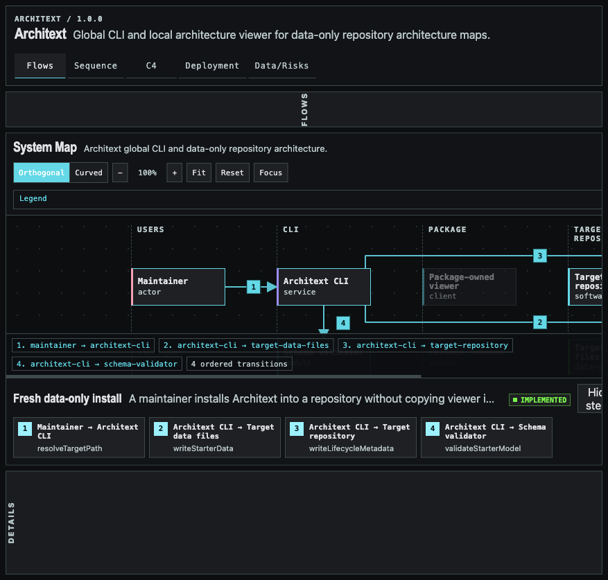
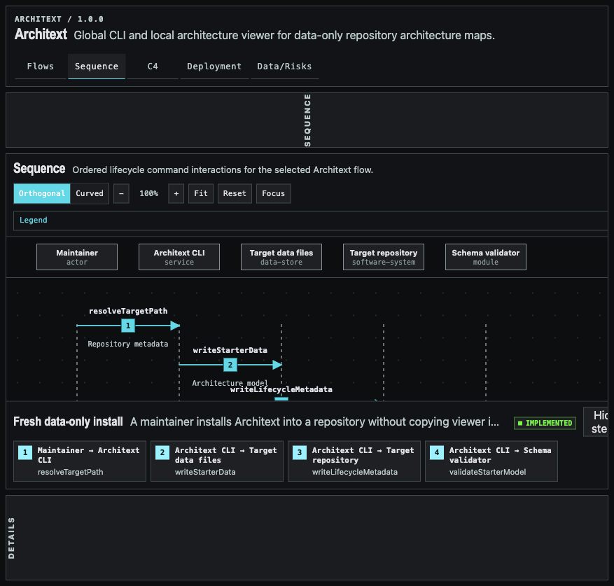
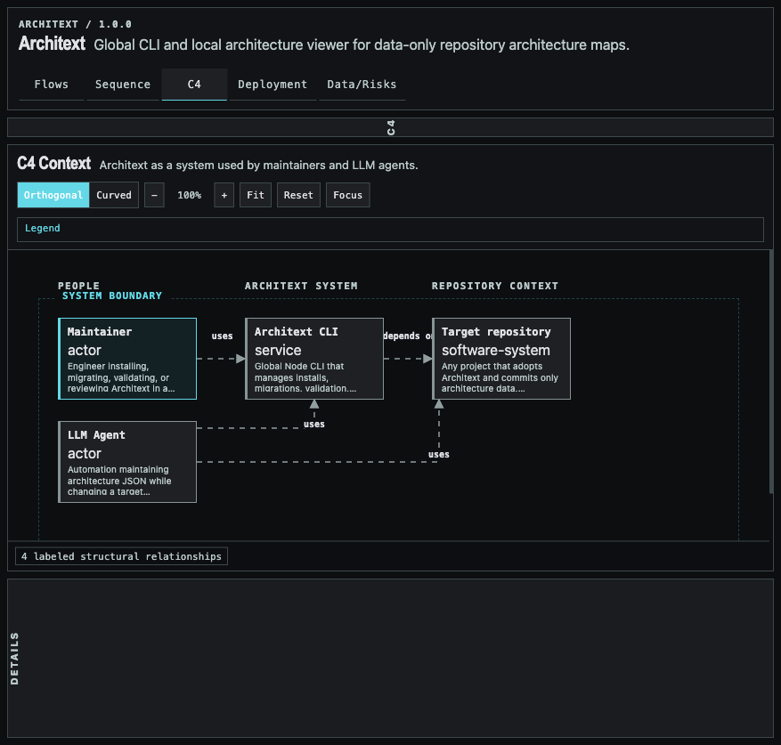
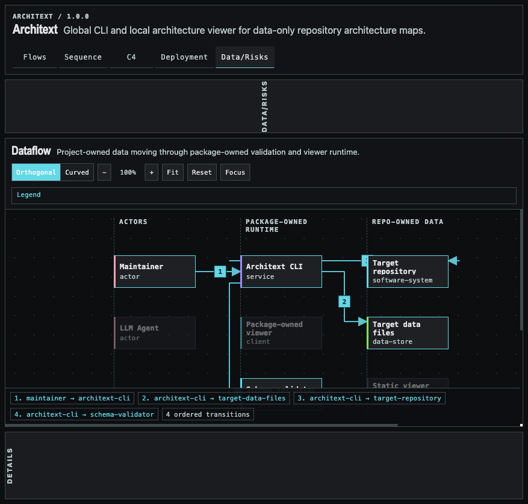

# Architext

[](LICENSE)
[](https://github.com/robot-accomplice/architext/actions/workflows/ci.yml)
[](https://www.npmjs.com/package/@robotaccomplice/architext)


Architext is a local, project-owned architecture and dataflow site generated
from strict JSON files.

It is meant for teams using LLMs to build and maintain software. The rendered
site gives humans a navigable view of the system. The JSON gives future LLMs a
stable architecture map they can read before changing code.

Architext is not a hosted documentation platform. It is a global CLI that reads
project-owned JSON from a repository and serves a local viewer from the
installed package.

## Why This Exists

Architecture documentation usually fails in one of two ways:

- it is prose written for humans and too vague for LLMs to use reliably
- it is generated from code and misses intent, risks, decisions, and data
  movement

Architext takes a different position: the machine-readable architecture model is
the source of truth, and the human site is a projection of that model.

The original project idea for Architext was inspired by [Dave J's x.com post
about interactive architecture and flow visualization](https://x.com/davej/status/2053867258653339746?s=46&t=e_qP9a_xUWuOJ6eKxFpaAQ).
Architext turns that kind of engineer-friendly architecture map into a local,
JSON-backed workflow that can live inside any project repository without
vendoring viewer code into that repository.

The JSON is intentionally not optimized for hand editing. LLMs are expected to
maintain it as architecture changes. Humans review the rendered site and the
JSON diffs.

## What Architext Tracks

Architext is intended to describe:

- systems, services, modules, jobs, workers, queues, stores, and external
  services
- ordered application and infrastructure flows
- data movement and data classification
- trust boundaries and security controls
- runtime and deployment topology
- ownership and source-code locations
- observability paths
- architectural decisions
- known risks and gaps
- verification commands or tests tied to architectural claims

The goal is not just to draw diagrams. The goal is to preserve enough structured
context that an LLM working later can understand what exists, where it lives,
why it exists, and what must stay true.

## Design Principles

- **Local first:** every project owns its own Architext files.
- **Read-only viewer:** editing happens through JSON changes, not the browser.
- **Strict schema:** invalid data should prevent rendering.
- **LLM-maintained:** JSON is structured for machine upkeep, not casual manual
  authoring.
- **Human-readable output:** engineers should be able to inspect flows and
  components quickly.
- **Ordered flows:** flows are explicit step-by-step paths, not loose dependency
  graphs.
- **Project-neutral look and feel:** projects provide data, not custom UI
  behavior.
- **No hosted dependency:** the site runs from a local dev server or static
  build.
- **No runtime CDN:** scripts, styles, fonts, schemas, and assets must be local
  to the repository or bundled into the build.

## Planned Experience

The viewer will use a dense engineering layout:

- collapsible navigation on the left
- large diagram canvas in the center
- selected-node and selected-step details on the right
- search and filters
- pan, zoom, fit, and maximize controls
- per-view orthogonal or curved route rendering
- highlighted ordered paths through flows
- scrollable detail sections for architecture, security, data, risks, and tests

The UI should be functional before it is pretty. Diagram space, legibility, and
fast inspection matter more than branding.

## Current Demo

The repository demo now documents Architext itself: global CLI lifecycle,
package-owned viewer runtime, data-only target repositories, migrations,
validation, and release packaging.









## Install Or Upgrade In A Project

The simplest interface is the `architext` CLI.

Install it globally:

```sh
npm install -g @robotaccomplice/architext
```

From a local Architext clone during development, install the current checkout:

```sh
npm install -g /path/to/architext
```

After that, from any target project repository:

```sh
architext sync
```

You can also pass a target repository explicitly:

```sh
architext sync /path/to/your-project
```

The default `sync` behavior detects the current state:

- if `docs/architext/data` is absent, it installs neutral starter data
- if an old copied-template install is present, it migrates the repository to
  the data-only layout
- if the repository is current, it validates and reports the next action

The script prompts before writing changes. In a git repository, it also asks
whether to use the current branch or create a new branch first.

Architext no longer installs dependencies inside target repositories. Viewer
code, schemas, validation, and starter templates are package-owned. Target
repositories commit architecture data, lifecycle metadata, and optional
repository-level agent instructions.

When the target repository has a root `package.json`, the CLI can add
convenience scripts:

```sh
npm run architext
npm run architext:validate
npm run architext:build
npm run architext:doctor
npm run architext:prompt
npm run architext:clean
```

Those root scripts call the global `architext` CLI with `.` as the target path.

Install explicitly:

```sh
architext sync
```

Upgrade explicitly:

```sh
architext sync
```

Run non-interactively:

```sh
architext sync . --yes --branch current --append-agents --root-scripts
```

Useful options:

- pass `[path]` after the command to operate on a repository other than the
  current directory.
- `--dry-run` shows intended changes without writing files.
- `--branch new --branch-name <name>` creates a branch before writing.
- `--branch current` writes to the current branch.
- `--append-agents` creates or appends both `AGENTS.md` and `CLAUDE.md` with the
  Architext instructions.
- `--no-agents` skips `AGENTS.md` and `CLAUDE.md` prompts.
- `--root-scripts` adds root `package.json` convenience scripts.
- `--no-root-scripts` skips root `package.json` script prompts.
- `--update-gitignore` adds Architext generated artifact ignores without
  prompting.
- `--no-gitignore` skips `.gitignore` prompts.
- `--skip-validate` skips architecture JSON validation after writing artifacts.
- `--force` reruns lifecycle management even when the repository appears
  current.

Migration preserves `docs/architext/data/*.json` by default because those files
belong to the target project. It removes copied viewer/schema/tool files from
old installs, rewrites Architext lifecycle metadata, and corrects old agent
instructions so agents use the global CLI and edit only target-owned data. Use
`--overwrite-data` only when intentionally resetting the target architecture
data to neutral starter data.

By default, the script also prompts to keep `docs/architext/dist/` ignored.
That directory is generated by `architext build` and should not be committed.

## Legacy Copied-Template Upgrades

Architext 1.0.0 is a breaking upgrade for repositories that previously copied
the full template into `docs/architext`. Those installs usually contain files
such as:

```text
docs/architext/src/
docs/architext/schema/
docs/architext/tools/
docs/architext/public/
docs/architext/package.json
docs/architext/package-lock.json
docs/architext/vite.config.ts
docs/architext/tsconfig.json
```

Those files are package-owned in 1.0.0 and should be removed from target
repositories during migration. The project-owned files are preserved:

```text
docs/architext/data/*.json
docs/architext/.architext.json
AGENTS.md and/or CLAUDE.md Architext section, when present
```

Preview a legacy migration first:

```sh
architext sync /path/to/project --dry-run
```

The dry-run reports copied package-owned files that would be removed, confirms
that `docs/architext/data/*.json` is preserved, reports agent instruction
updates, and runs validation against the preserved data when possible.

Run the migration:

```sh
architext sync /path/to/project --yes --branch current
```

During migration, Architext replaces the managed `## Architext Architecture
Documentation` section in `AGENTS.md` and `CLAUDE.md` with global-CLI guidance.
Unrelated project instructions outside that section are preserved. After
migration, agents should update only `docs/architext/data/*.json`, run
`architext validate [path]`, and use `architext serve [path]` for visual review.

The CLI also writes lifecycle metadata to:

```text
docs/architext/.architext.json
```

This file records the CLI version, update time, operation, migrated install
state, managed instruction files, gitignore/root-script handling, and last
validation state. It is automation state, not the architecture model.

## Management Commands

Once the CLI is available, these commands work from the target project root:

```sh
architext doctor [path]
architext status [path]
architext status [path] --json
architext serve [path]
architext validate [path]
architext build [path]
architext prompt [path]
architext clean [path]
architext explain flows
```

Use `doctor` when something looks wrong. It reports the installed version,
whether an upgrade is needed, validation status, missing ignore rules, missing
AGENTS/CLAUDE appendix sections, root script status, and accidentally tracked
generated artifacts.

Use `prompt` to print LLM-ready instructions:

```sh
architext prompt --mode initial-buildout
architext prompt --mode architecture-change
architext prompt --mode repair-validation
```

Use `clean` to remove generated local build output. It removes
`docs/architext/dist/` by default. Pass `--node-modules` only when you also want
to remove local dependencies:

```sh
architext clean --node-modules
```

## Local Usage

From a project that has adopted Architext:

```sh
architext serve
```

Then open:

```text
http://localhost:4317/
```

Architext requires a local server instead of direct `file://` loading. That
avoids browser-specific restrictions around fetching local JSON files.

The running site must not fetch framework code, stylesheets, fonts, or assets
from remote URLs.

For static usage after a build:

```sh
architext build
cd docs/architext/dist
python3 -m http.server 4317
```

Project scripts should remain cross-platform. Avoid shell-specific command
chains in npm scripts so the same commands work on Windows, Linux, and macOS.

## LLM JSON Build-Out Prompt

After installing Architext into a target repository, give the project LLM a
direct instruction like this:

```text
You are working in this repository. Build out Architext for this project.

First read:
- AGENTS.md and/or CLAUDE.md if present
- docs/architext/data/*.json

Then inspect the codebase and replace the neutral starter data with this
project's real architecture data. Update only docs/architext/data/*.json unless
the Architext package itself is being changed.

Required output:
- nodes.json: real actors, systems, services, clients, modules, workers,
  queues/topics, data stores, external services, deployment units, and trust
  boundaries
- flows.json: ordered user/system/data flows with real source and target node
  IDs, data classes, guarantees, failure behavior, observability, and
  verification references
- views.json: system map, dataflow, deployment, sequence, and C4 context /
  container / component projections using existing node IDs
- data-classification.json: data classes actually handled by the project
- decisions.json: accepted architecture decisions or links to existing ADRs
- risks.json: real architecture, security, privacy, operational, and data risks
- glossary.json: project terms that future LLMs need to understand
- manifest.json: project identity, default view, and file references

Persist in git:
- docs/architext/data/*.json
- docs/architext/.architext.json

Ensure these generated/local artifacts are ignored:
- docs/architext/dist/
- .DS_Store
- editor/OS temp files
- local server logs
- screenshots created only for debugging unless intentionally added to project
  documentation

Rules:
- Reuse stable IDs for existing concepts.
- Create nodes before referencing them from flows or views.
- Keep flows ordered.
- Do not invent certainty. Mark unknowns and known gaps explicitly.
- Prefer source-path-backed claims.
- Do not edit application code for this task.
- Do not edit copied viewer, schema, package, Vite, or local tool files in the
  target repository.
- Run `architext validate` before claiming completion.
- If validation fails, fix the JSON and rerun it.

When finished, summarize what files changed, what architecture areas are well
covered, what remains uncertain, and the validation result.
```

## Expected Project Structure

```text
docs/
  architext/
    data/
      manifest.json
      nodes.json
      flows.json
      views.json
      data-classification.json
      decisions.json
      risks.json
      glossary.json
    .architext.json
```

The exact files may evolve, but the split is intentional: nodes, flows, views,
data classification, decisions, and risks are separate concerns.

## Data Model Overview

`manifest.json` is the entrypoint. It identifies the project, schema version,
default view, and data files to load.

`nodes.json` describes architectural elements such as services, modules,
clients, actors, data stores, queues, workers, external services, and trust
boundaries.

`flows.json` describes ordered flows. Each step references known nodes and
documents what moves, what is validated, what can fail, and what proves the
behavior.

`views.json` describes how the same model is projected into system maps, C4
views, dataflow diagrams, deployment views, and risk overlays.

`data-classification.json` defines the data categories used by flows and nodes.

`decisions.json` and `risks.json` connect architecture facts to the reasoning
and tradeoffs behind them.

## LLM Workflow

An LLM working in a project that uses Architext should:

1. Read the existing Architext data before changing architecture.
2. Update the relevant JSON when architecture changes.
3. Reuse existing IDs for existing concepts.
4. Add new nodes before referencing them in flows.
5. Keep flows ordered.
6. Update data classification when data movement changes.
7. Update risks when adding persistence, external services, trust boundaries,
   sensitive data, async processing, or operational complexity.
8. Run validation before claiming the task is complete.

Broken architecture JSON is worse than missing JSON because it gives future
humans and LLMs false confidence.

## Example Project

Architext includes a self-hosted example based on Architext itself. The example
documents the global CLI, package-owned viewer, validation flow, data-only
target repository layout, migration behavior, and release/package lifecycle.

## Distribution

Architext is intended to be installed as a global npm CLI:

```sh
npm install -g @robotaccomplice/architext
architext sync
architext serve
```

## Repository Status

This repository now includes the working local viewer, schemas, validation
tooling, global CLI lifecycle script, and the self-hosted Architext demo model.

Core documents:

- [Architecture Plan](docs/architecture/ARCHITECTURE_PLAN.md)
- [Routing Correctness Plan](docs/architecture/ROUTING_PLAN.md)
- [Routing Framework Comparison](docs/architecture/ROUTING_FRAMEWORK_COMPARISON.md)
- [LLM Architext Contract](docs/architecture/LLM_ARCHITEXT.md)
- [Agent Instructions Appendix](docs/architecture/AGENTS_APPENDIX.md)

## Attribution

The original project idea for Architext was inspired by [Dave J's x.com post
about interactive architecture and flow visualization](https://x.com/davej/status/2053867258653339746?s=46&t=e_qP9a_xUWuOJ6eKxFpaAQ).

Routing work also studies established diagramming and layout systems as
algorithm references. Architext's router is custom project code; it does not
copy source code from those projects. See
[THIRD_PARTY_NOTICES.md](THIRD_PARTY_NOTICES.md) and the
[Routing Framework Comparison](docs/architecture/ROUTING_FRAMEWORK_COMPARISON.md)
for license posture and attribution.

## License

MIT. See [LICENSE](LICENSE).
