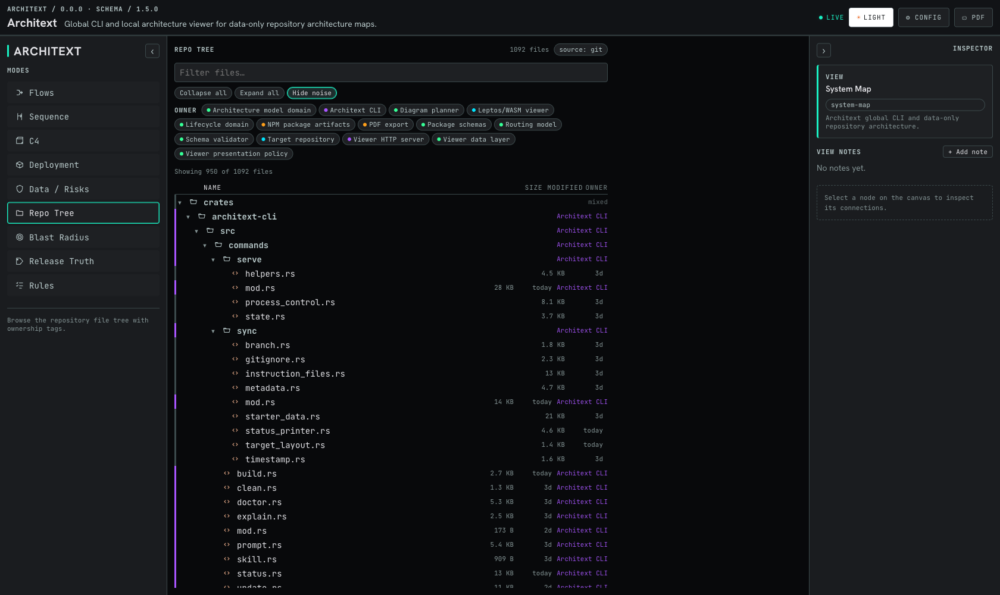
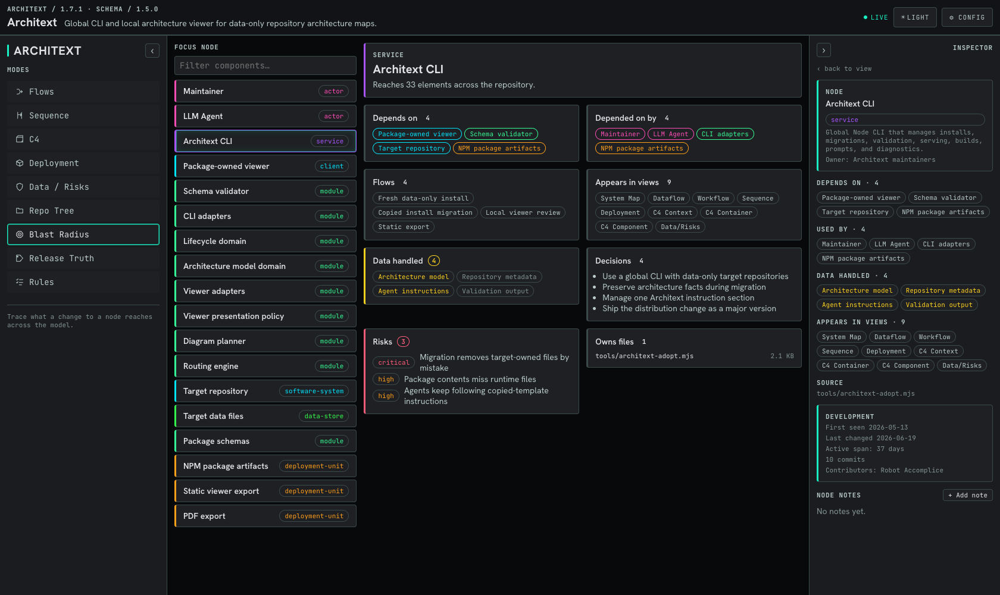
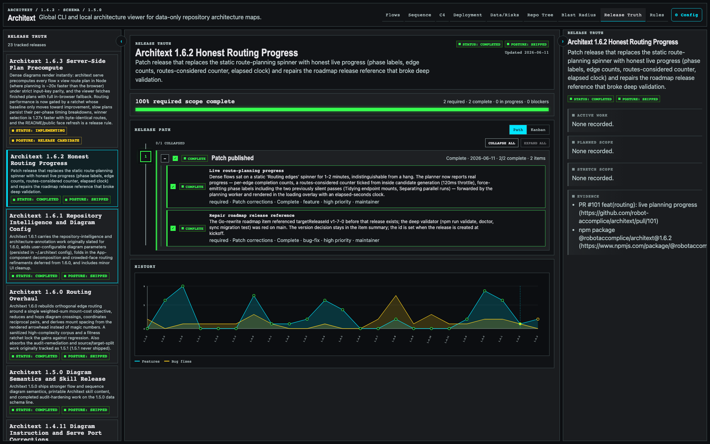
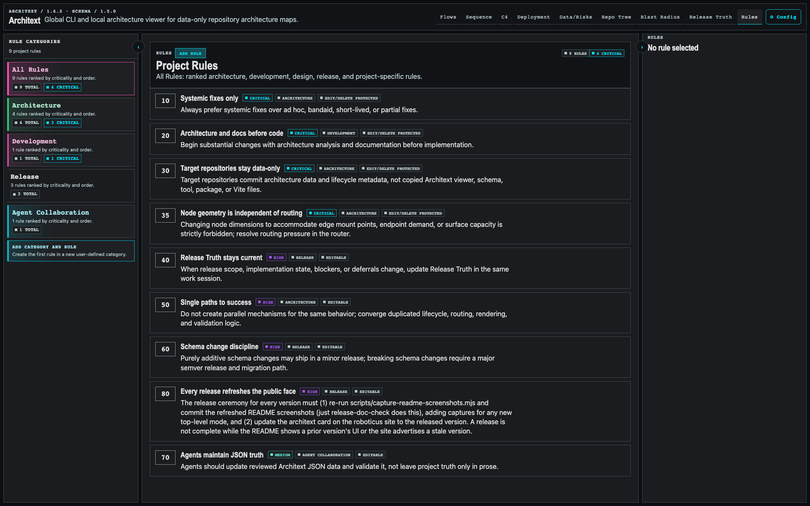

# Architext

[](LICENSE)
[](https://github.com/robot-accomplice/architext/actions/workflows/ci.yml)
[](https://www.npmjs.com/package/@robotaccomplice/architext)


Architext is a local, project-owned architecture, release, rules, and dataflow
viewer generated from strict JSON files.

It is meant for teams using LLMs to build and maintain software. The rendered
site gives humans a navigable view of the system. The JSON gives future LLMs a
stable architecture, release, and project-rules map they can read before
changing code.

Architext is not a hosted documentation platform. It is a global CLI that reads
project-owned JSON from a repository and serves a local viewer from the
installed package.

## Why This Exists

Architecture documentation usually fails in one of two ways:

- it is prose written for humans and too vague for LLMs to use reliably
- it is generated from code and misses intent, risks, decisions, and data
  movement

Architext takes a different position: the machine-readable architecture model is
the source of truth, and the human site is a projection of that model.

The original project idea for Architext was inspired by [Dave J's x.com post
about interactive architecture and flow visualization](https://x.com/davej/status/2053867258653339746?s=46&t=e_qP9a_xUWuOJ6eKxFpaAQ).
Architext turns that kind of engineer-friendly architecture map into a local,
JSON-backed workflow that can live inside any project repository without
vendoring viewer code into that repository.

The JSON is intentionally not optimized for hand editing. LLMs are expected to
maintain it as architecture changes. Humans review the rendered site and the
JSON diffs.

## What Architext Tracks

Architext is intended to describe:

- systems, services, modules, jobs, workers, queues, stores, and external
  services
- ordered application and infrastructure flows
- data movement and data classification
- trust boundaries and security controls
- runtime and deployment topology
- ownership and source-code locations
- observability paths
- architectural decisions
- known risks and gaps
- verification commands or tests tied to architectural claims
- Release Truth: scope, status, blockers, milestones, evidence, and historical
  feature/fix volume
- release planning source items and approved release plans
- ranked project rules that apply across LLMs and local workflows

The goal is not just to draw diagrams. The goal is to preserve enough structured
context that an LLM working later can understand what exists, where it lives,
why it exists, and what must stay true.

## Design Principles

- **Local first:** every project owns its own Architext files.
- **Data-owned viewer:** project truth lives in JSON; browser editors are scoped
  to structured release and rule updates.
- **Strict schema:** invalid data should prevent rendering.
- **LLM-maintained:** JSON is structured for machine upkeep, not casual manual
  authoring.
- **Human-readable output:** engineers should be able to inspect flows and
  components quickly.
- **Ordered flows:** flows are explicit step-by-step paths, not loose dependency
  graphs.
- **Model-agnostic rules:** project rules live in Architext data instead of
  drifting across model-specific instruction files.
- **Project-neutral look and feel:** projects provide data, not custom UI
  behavior.
- **No hosted dependency:** the site runs from a local dev server or static
  build.
- **No runtime CDN:** scripts, styles, fonts, schemas, and assets must be local
  to the repository or bundled into the build.

## Viewer Experience

The viewer uses a dense engineering layout:

- collapsible navigation on the left
- large diagram canvas in the center
- selected-node and selected-step details on the right
- search and filters
- pan, zoom, fit, and maximize controls
- per-view orthogonal, spline, or straight route rendering where diagrams use
  routed lines
- highlighted ordered paths through flows
- C4 drilldown when lower-level diagrams exist
- PDF export through the browser print flow
- scoped browser editors for Release Truth planning and project Rules
- scrollable detail sections for architecture, security, data, risks, tests,
  release state, and rules

Diagram space, legibility, and fast inspection matter more than branding.

## Current Architecture Model

The repository data documents Architext itself: global CLI lifecycle,
package-owned viewer runtime, data-only target repositories, migrations,
validation, release tracking, rules, and release packaging.










## Installing Architext

Architext ships as a self-contained native binary. No Node runtime is required.

### Quick install (recommended)

```sh
curl -fsSL https://raw.githubusercontent.com/robot-accomplice/architext/main/install.sh | sh
```

This downloads the latest release binary for your platform, verifies its SHA-256
checksum, and installs it to `~/.local/bin` (override with
`ARCHITEXT_INSTALL_DIR`). Make sure that directory is on your `PATH`.

### Manual native install

Download the binary for your platform from the
[latest release](https://github.com/robot-accomplice/architext/releases/latest)
(`architext-darwin-arm64`, `architext-darwin-x64`, `architext-linux-x64`,
`architext-linux-arm64`, or `architext-win32-x64.exe`), verify it against
`SHA256SUMS`, make it executable, and put it on your `PATH`.

### Via npm (transitional)

npm is supported as a bridge for existing users while Architext moves to native
distribution. It installs the same native binary behind a thin launcher:

```sh
npm install -g @robotaccomplice/architext
```

Use the scoped package name exactly; the unscoped `architext` npm package is an
unrelated project.

### Keeping it current

```sh
architext update          # download + install the latest native binary
architext --check-updates # report whether a newer version is available
```

`architext update` replaces the running binary in place. If it detects an
npm-managed install, it installs a native copy to `~/.local/bin` and prints the
steps to drop the npm version — the comfortable path off npm.

## Adopt Architext In A Project

From any target project repository:

```sh
architext sync
```

`install` and `init` are synonyms for `sync`.

You can also pass a target repository explicitly:

```sh
architext sync /path/to/your-project
```

The default `sync` behavior detects the current state:

- if `docs/architext/data` is absent, it installs neutral starter data
- if an old copied-template install is present, it migrates the repository to
  the data-only layout
- if the repository is current, it validates and reports the next action

The script prompts before writing changes. In a git repository, it also asks
whether to use the current branch or create a new branch first.

Architext no longer installs dependencies inside target repositories. Viewer
code, schemas, validation, and starter templates are package-owned. Target
repositories commit architecture data, lifecycle metadata, and optional
repository-level agent instructions.

Install or update project data explicitly:

```sh
architext sync
```

(`architext upgrade` no longer means `sync`; it updates the architext binary.
Use `architext sync` for project data.)

Run non-interactively:

```sh
architext sync . --yes --branch current --append-agents
```

After `sync` records repository-level prompt answers, later interactive syncs
offer to reuse those answers. Use `--prompt` to force the prompts again, or
`--quiet` to select the default sync choices without asking.

Useful options:

- pass `[path]` after the command to operate on a repository other than the
  current directory.
- `--quiet` selects default sync choices without interactive prompts.
- `--prompt` bypasses saved sync choices and asks the normal sync prompts.
- `--dry-run` shows intended changes without writing files.
- `--branch new --branch-name <name>` creates a branch before writing.
- `--branch current` writes to the current branch.
- `--append-agents` creates or appends both `AGENTS.md` and `CLAUDE.md` with the
  Architext instructions.
- `--no-agents` skips `AGENTS.md` and `CLAUDE.md` prompts.
- `--update-gitignore` adds Architext generated artifact ignores without
  prompting.
- `--no-gitignore` skips `.gitignore` prompts.
- `--skip-validate` skips architecture JSON validation after writing artifacts.
- `--force` reruns lifecycle management even when the repository appears
  current.

Migration preserves `docs/architext/data/*.json` by default because those files
belong to the target project. It removes copied viewer/schema/tool files from
old installs, rewrites Architext lifecycle metadata, and corrects old agent
instructions so agents use the global CLI and edit only target-owned data. Use
`--overwrite-data` only when intentionally resetting the target architecture
data to neutral starter data.

By default, the script also prompts to keep `docs/architext/dist/` ignored.
That directory is generated by `architext build` and should not be committed.

## Legacy Copied-Template Upgrades

Architext 1.0.0 is a breaking upgrade for repositories that previously copied
the full template into `docs/architext`. Those installs usually contain files
such as:

```text
docs/architext/src/
docs/architext/schema/
docs/architext/tools/
docs/architext/public/
docs/architext/package.json
docs/architext/package-lock.json
docs/architext/vite.config.ts
docs/architext/tsconfig.json
```

Those files are package-owned in 1.0.0 and should be removed from target
repositories during migration. The project-owned files are preserved:

```text
docs/architext/data/*.json
docs/architext/.architext.json
optional AGENTS.md, CLAUDE.md, Cursor rule, or .cursorrules pointers
```

Preview a legacy migration first:

```sh
architext sync /path/to/project --dry-run
```

The dry-run reports copied package-owned files that would be removed, confirms
that `docs/architext/data/*.json` is preserved, reports agent instruction
updates, and runs validation against the preserved data when possible.

Run the migration:

```sh
architext sync /path/to/project --yes --branch current
```

During migration, Architext replaces the managed `## Architext Architecture
Documentation` section in `AGENTS.md` and `CLAUDE.md` with global-CLI guidance.
Unrelated project instructions outside that section are preserved. After
migration, agents should update only `docs/architext/data/*.json`, run
`architext validate [path]`, and use `architext serve [path]` for visual review.

The CLI also writes lifecycle metadata to:

```text
docs/architext/.architext.json
```

This file records the CLI version, update time, operation, migrated install
state, managed instruction files, gitignore handling, and last
validation state. It is automation state, not the architecture model.

## Management Commands

Once the CLI is available, these commands work from the target project root:

```sh
architext doctor [path]
architext status [path]
architext status [path] --json
architext serve [path]
architext validate [path]
architext build [path]
architext prompt [path]
architext skill
architext clean [path]
architext explain flows
architext version
architext --version
architext update
architext --check-updates
```

Use `doctor` when something looks wrong. It reports the installed version,
whether an upgrade is needed, validation status, missing ignore rules, missing
AGENTS/CLAUDE appendix sections, accidentally tracked
generated artifacts, model-specific `AGENTS.md`, `CLAUDE.md`, Cursor rule, and
`.cursorrules` project rules that can be migrated into
`docs/architext/data/rules.json`, and deterministic repairs. Run `doctor --yes`
to apply available repairs.

Use `version` or `--version` when scripts need the installed package version
without inspecting `package.json`.

`sync` runs the same doctor diagnostics by default before converging lifecycle
state. Deterministic repairs preserve existing nodes, dependencies, architecture
facts, and unrelated project instructions.

Use `prompt` to print LLM-ready instructions:

```sh
architext prompt --mode initial-buildout
architext prompt --mode architecture-change
architext prompt --mode repair-validation
```

Use `skill` to print the package-owned Architext `SKILL.md` content directly to
the terminal. This is intended for maintainers who want to paste the skill into
an LLM chat session and ask that model to create its own model-specific skill
without first learning that model's skill installation mechanism:

```sh
architext skill
```

## Claude Code Plugin

Architext also ships a Claude Code plugin marketplace manifest in the
repository root under `.claude-plugin/`. Claude Code expects marketplace
repositories to expose `.claude-plugin/marketplace.json`; Architext's
marketplace contains the `architext` plugin, which contributes the packaged
Architext skill.

From inside Claude Code, add the Robot Accomplice Architext repository as a
marketplace:

```text
/plugin marketplace add robot-accomplice/architext
```

Then install the plugin from that marketplace:

```text
/plugin install architext@architext
```

Reload plugins in the current Claude Code session:

```text
/reload-plugins
```

For non-interactive setup, use the Claude Code CLI:

```sh
claude plugin marketplace add robot-accomplice/architext
claude plugin install architext@architext
```

Use `--scope project` on those CLI commands when a repository should share the
marketplace and plugin through `.claude/settings.json`; omit it for user-scope
installation. Claude Code copies marketplace plugins into its local plugin
cache, so update the marketplace when Architext releases a new plugin version:

```sh
claude plugin marketplace update architext
```

Use `clean` to remove generated local build output. It removes
`docs/architext/dist/` by default. Pass `--node-modules` only when you also want
to remove local dependencies:

```sh
architext clean --node-modules
```

## Local Usage

From a project that has adopted Architext:

```sh
architext serve
```

Then open the printed URL:

```text
http://127.0.0.1:4317/
```

Architext requires a local server instead of direct `file://` loading. That
avoids browser-specific restrictions around fetching local JSON files.

The running site must not fetch framework code, stylesheets, fonts, or assets
from remote URLs.

The default preferred port is `4317`. If that port is already occupied, serve
startup advances to the next available loopback port and prints the actual URL.

By default, `serve` stays in the foreground and keeps the terminal attached.
Use explicit lifecycle switches when you want a different behavior:

```sh
architext serve --open
architext serve --background
architext serve --background --open
architext --list
architext serve --list
architext serve --status
architext serve --stop
architext serve --stop --instance <id>
architext serve --refresh --instance <id>
architext --check-updates
architext serve --host 127.0.0.1 --port 4517
```

`--background` starts a detached local viewer server, waits until it is
reachable, prints the URL, and returns control to the shell. `--status` reports
the recorded serve process for the target repository. `--list` reports all
running foreground and background serve processes with stable instance ids. `--stop --instance
<id>` stops a specific listed server without relying on the current directory.
`--refresh`, `--update`, and `--restart` sync a background instance target with
the current Architext package and then relaunch the same target on the same host
and port. If sync fails, the existing server is left running.

`--check-updates` reports whether a newer Architext release is available on
GitHub; run `architext update` to install it. `--open`
launches the system browser after the viewer is reachable. The command always
prints a plain local URL so terminals that auto-link URLs remain enough even
when browser launch is unavailable.

Serve lifecycle options:

| Option | Behavior |
| --- | --- |
| `--foreground` | Force the compatibility behavior: run in the current terminal until interrupted. |
| `--background` | Start a detached local viewer server and return control after the URL is reachable. |
| `--open` | Launch the system browser after the local viewer is reachable. |
| `--no-open` | Suppress browser launch when combining options or future aliases. |
| `--host <host>` | Bind to a loopback host (`localhost`, `127.0.0.1`, or `::1`). Defaults to `127.0.0.1`. |
| `--port <port>` | Preferred starting port. Defaults to `4317`; startup advances to the next available loopback port when occupied. |
| `--list` | List all reachable foreground and background serve processes and remove stale records. |
| `--instance <id>` | Target a listed serve instance for status, stop, or refresh. |
| `--status` | Show the recorded serve process for this target and verify that it is reachable. |
| `--stop` | Stop the recorded serve process for this target and remove stale runtime state. |
| `--restart` | Sync and relaunch a recorded background server. |
| `--refresh` | Alias for `--restart`. |
| `--update` | Alias for `--restart`; use `--check-updates` for package installation. |
| `--check-updates` | Report whether a newer native release is available; install with `architext update`. |

Serve process state is local runtime state, not project architecture data. It is
not written into `docs/architext/data/*.json` and should not be committed.

For static usage after a build:

```sh
architext build
cd docs/architext/dist
python3 -m http.server 4317
```

Project scripts should remain cross-platform. Avoid shell-specific command
chains in npm scripts so the same commands work on Windows, Linux, and macOS.

## LLM JSON Build-Out Prompt

After installing Architext into a target repository, give the project LLM a
direct instruction like this:

```text
You are working in this repository. Build out Architext for this project.

First read:
- AGENTS.md and/or CLAUDE.md if present
- docs/architext/data/*.json

Then inspect the codebase and replace the neutral starter data with this
project's real architecture data. Update only docs/architext/data/*.json unless
the Architext package itself is being changed.

Required output:
- nodes.json: real actors, systems, services, clients, modules, workers,
  queues/topics, data stores, external services, deployment units, and trust
  boundaries
- flows.json: ordered user/system/data flows with real source and target node
  IDs, data classes, guarantees, failure behavior, observability, and
  verification references
- views.json: system map, dataflow, deployment, sequence, and C4 context /
  container / component projections using existing node IDs
- data-classification.json: data classes actually handled by the project
- decisions.json: accepted architecture decisions or links to existing ADRs
- risks.json: real architecture, security, privacy, operational, and data risks
- glossary.json: project terms that future LLMs need to understand
- rules.json: ranked project rules that should guide human and LLM work
- roadmap.json: candidate future work for release planning
- releases/index.json and releases/*.json: Release Truth history, current
  release posture, scope, milestones, blockers, evidence, and deferrals
- manifest.json: project identity, default view, and file references

Persist in git:
- docs/architext/data/*.json
- docs/architext/.architext.json

Ensure these generated/local artifacts are ignored:
- docs/architext/dist/
- .DS_Store
- editor/OS temp files
- local server logs
- screenshots created only for debugging unless intentionally added to project
  documentation

Rules:
- Reuse stable IDs for existing concepts.
- Create nodes before referencing them from flows or views.
- Keep flows ordered.
- Do not invent certainty. Mark unknowns and known gaps explicitly.
- Prefer source-path-backed claims.
- Do not edit application code for this task.
- Do not edit copied viewer, schema, package, Vite, or local tool files in the
  target repository.
- Run `architext validate` before claiming completion.
- If validation fails, fix the JSON and rerun it.

When finished, summarize what files changed, what architecture areas are well
covered, what remains uncertain, and the validation result.
```

## Expected Project Structure

```text
docs/
  architext/
    data/
      manifest.json
      nodes.json
      flows.json
      views.json
      data-classification.json
      decisions.json
      risks.json
      glossary.json
      rules.json
      roadmap.json
      releases/
        index.json
        v*.json
    .architext.json
```

The exact files may evolve, but the split is intentional: nodes, flows, views,
data classification, decisions, risks, rules, roadmap, and releases are
separate concerns.

## Data Model Overview

`manifest.json` is the entrypoint. It identifies the project, Architext data
schema version, default view, and data files to load. The schema version tracks
the JSON data contract, not the installed CLI package version. Additive schema
changes may ship in minor releases; breaking schema changes require a major
semver release and an Architext-managed migration path.

`nodes.json` describes architectural elements such as services, modules,
clients, actors, data stores, queues, workers, external services, and trust
boundaries.

`flows.json` describes ordered flows. Each step references known nodes and
documents what moves, what is validated, what can fail, and what proves the
behavior.

`views.json` describes how the same model is projected into system maps, C4
views, dataflow diagrams, deployment views, and risk overlays.

`data-classification.json` defines the data categories used by flows and nodes.

`decisions.json` and `risks.json` connect architecture facts to the reasoning
and tradeoffs behind them.

`rules.json` records ranked project rules with category, criticality, source,
and edit/delete protection. It is the model-agnostic place for rules that should
not drift across agent-specific instruction files.

`roadmap.json` records candidate future work. Release Planning can use those
items, plus ad hoc entries, to draft a target release.

`releases/index.json` and `releases/*.json` power Release Truth: current release
status, posture, scope, blockers, milestones, dependencies, evidence, and
historical feature/fix trends.

## LLM Workflow

An LLM working in a project that uses Architext should:

1. Read the existing Architext data before changing architecture.
2. Update the relevant JSON when architecture changes.
3. Reuse existing IDs for existing concepts.
4. Add new nodes before referencing them in flows.
5. Keep flows ordered.
6. Update data classification when data movement changes.
7. Update risks when adding persistence, external services, trust boundaries,
   sensitive data, async processing, or operational complexity.
8. Update Release Truth under `docs/architext/data/releases/` when release
   scope, blockers, milestones, evidence, dependencies, target dates, or
   posture change.
9. Keep Release Path labels concise and put rationale, blocker explanations,
   dependencies, next actions, and evidence in the selected release item's
   detail data.
10. Update `docs/architext/data/rules.json` when project rules change. Respect
    rule category, criticality, ordering, and edit/delete protection.
11. Use `docs/architext/data/roadmap.json` for candidate future work and
    Release Truth for approved or historical release scope.
12. Run validation before claiming the task is complete.

Broken architecture JSON is worse than missing JSON because it gives future
humans and LLMs false confidence.

## Example Project

Architext includes a self-hosted example based on Architext itself. The example
documents the global CLI, package-owned viewer, validation flow, data-only
target repository layout, migration behavior, and release/package lifecycle.

## Distribution

Architext is distributed as native binaries for macOS, Linux, and Windows
(arm64 and x64), built and published from CI with sigstore provenance. The
recommended install is the shell installer or a direct binary download from the
[releases page](https://github.com/robot-accomplice/architext/releases/latest);
see [Installing Architext](#installing-architext).

```sh
curl -fsSL https://raw.githubusercontent.com/robot-accomplice/architext/main/install.sh | sh
architext sync
architext serve
```

npm remains a transitional bridge (`npm install -g @robotaccomplice/architext`)
that installs the same native binary behind a thin launcher. It is being retired
in favor of native distribution plus `architext update`. Use the scoped package
name exactly.

## Repository Status

This repository now includes the working local viewer, schemas, validation
tooling, global CLI lifecycle script, and the self-hosted Architext architecture
model.

Core documents:

- [Architecture Plan](docs/architecture/ARCHITECTURE_PLAN.md)
- [Routing Correctness Plan](docs/architecture/ROUTING_PLAN.md)
- [Routing Framework Comparison](docs/architecture/ROUTING_FRAMEWORK_COMPARISON.md)
- [LLM Architext Contract](docs/architecture/LLM_ARCHITEXT.md)
- [Agent Instructions Appendix](docs/architecture/AGENTS_APPENDIX.md)

## Attribution

The original project idea for Architext was inspired by [Dave J's x.com post
about interactive architecture and flow visualization](https://x.com/davej/status/2053867258653339746?s=46&t=e_qP9a_xUWuOJ6eKxFpaAQ).

Routing work also studies established diagramming and layout systems as
algorithm references. Architext's router is custom project code; it does not
copy source code from those projects. See
[THIRD_PARTY_NOTICES.md](THIRD_PARTY_NOTICES.md) and the
[Routing Framework Comparison](docs/architecture/ROUTING_FRAMEWORK_COMPARISON.md)
for license posture and attribution.

## License

MIT. See [LICENSE](LICENSE).
